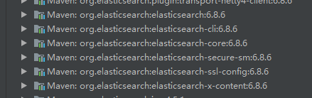
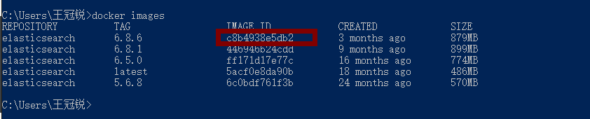

# Springboot整合ES终极版本

这应该是最简单的确定教程了。

使用环境：windows

软件：idea docker(windows) 

## 1 新建一个springboot工程

​	选择 web-Springweb

​	nosql - Spring Data - Elasticsearch

## 2 在新建的工程中选择External Libraries

可以看到 springboot自动引入的版本为 6.8.6

这时候去docker中拉取**6.8.6**的版本即可。

## 3 在docker中拉取6.8.6版本的elasticsearch

~~~xml
docker elasticsearch:6.8.6
~~~

查看镜像id

~~~xml
docker images
~~~

启动镜像并且设置名字加端口

~~~xml
docker run -d -p 9002:9002 -p 9003:9003 --name es01 镜像id
~~~

## 4 测试elasticsearch

在地址栏中 输入 localhost:9200

~~~xml
{
name: "4VVnLyc",
cluster_name: "docker-cluster",
cluster_uuid: "xaNxApE9T2ah_xb3YQmTVg",
version: {
number: "6.8.6",
build_flavor: "default",
build_type: "docker",
build_hash: "3d9f765",
build_date: "2019-12-13T17:11:52.013738Z",
build_snapshot: false,
lucene_version: "7.7.2",
minimum_wire_compatibility_version: "5.6.0",
minimum_index_compatibility_version: "5.0.0"
},
tagline: "You Know, for Search"
}
~~~

这里要**记住cluster_name 的值**

## 4 配置springboot  application.yml

~~~xml
spring:
 data:
  elasticsearch:
   cluster-name: docker-cluster
   cluster-nodes: 192.168.0.102:9300
~~~

## 5编写代码

编写bean类

~~~java
@Document(indexName = "library")
@Data
public class Book {
    private Integer id;
    private String bookName;
    private String author;
}

~~~

注解 Document 代表存入的索引名称

编写Responsitory

~~~java
public interface BookRepository extends ElasticsearchRepository<Book,Integer> {
    List<Book> findByBookNameLike(String bookName);
}

~~~

编写测试类

~~~java
 @Test
    void contextLoads() {
        Book book = new Book();
        book.setId(1);
        book.setAuthor("六老师");
        book.setBookName("西游记");

        for (Book book1 : bookRepository.findByBookNameLike("游")) {
            System.out.println(book1.toString());
        }
    }
~~~

## 6启动测试