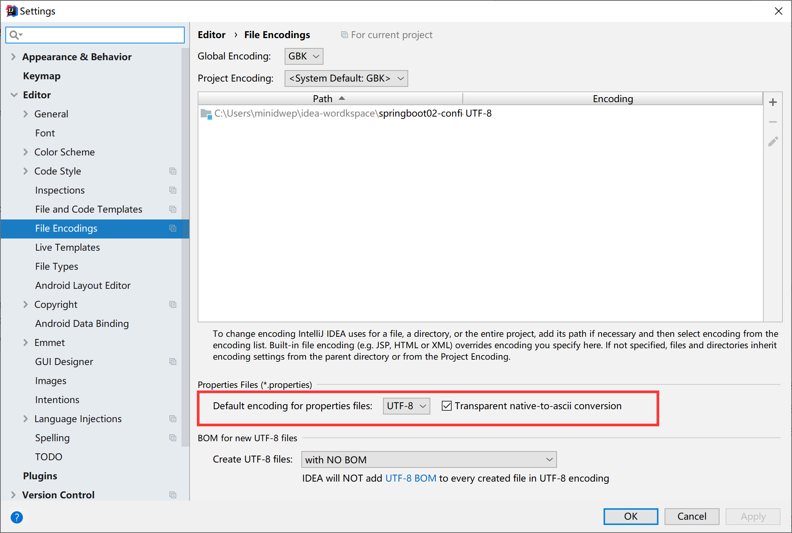
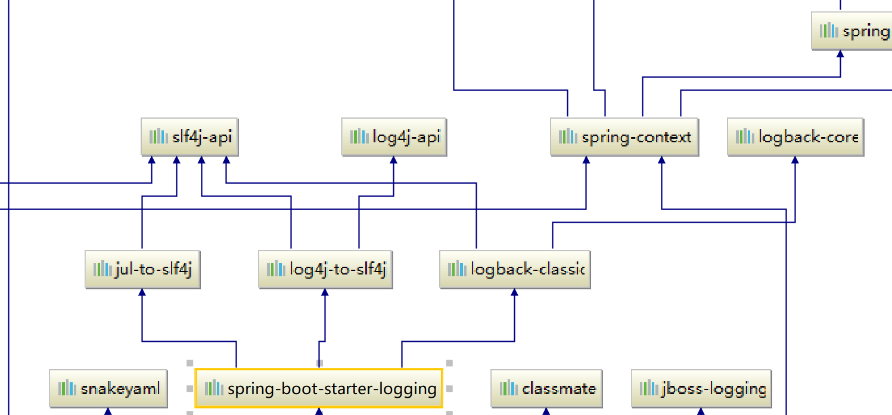
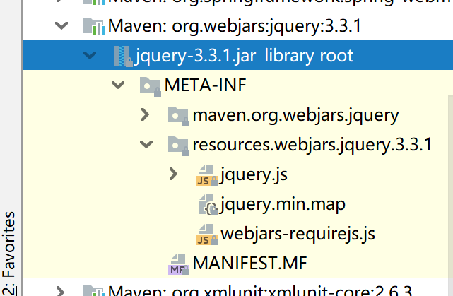
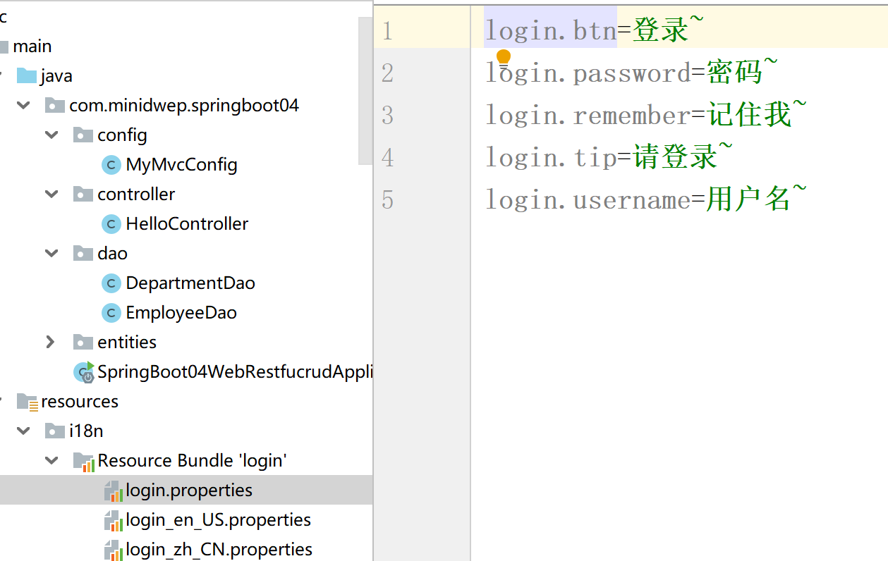
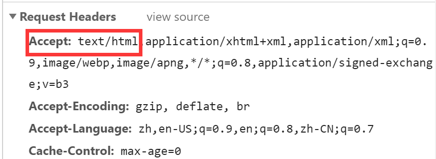
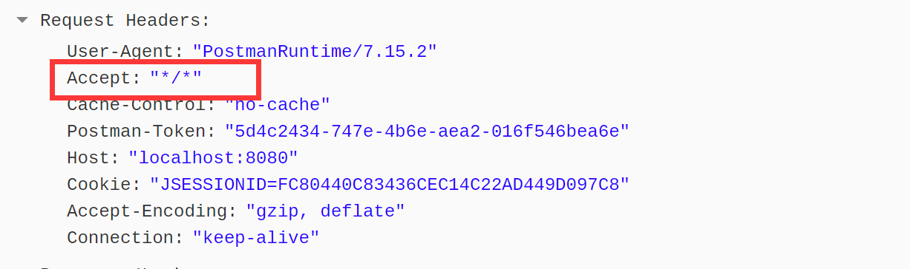
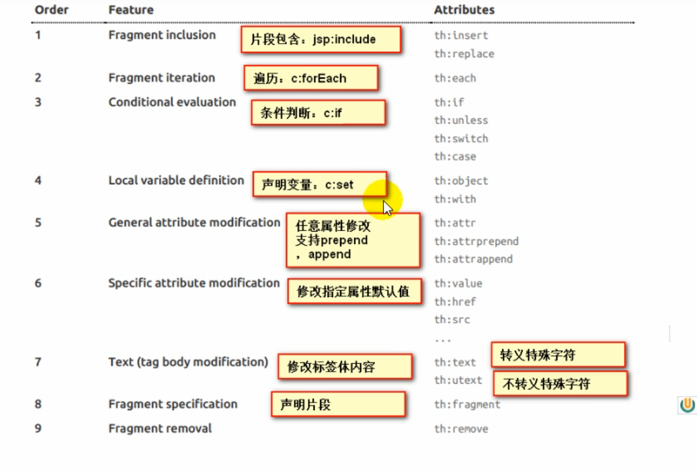
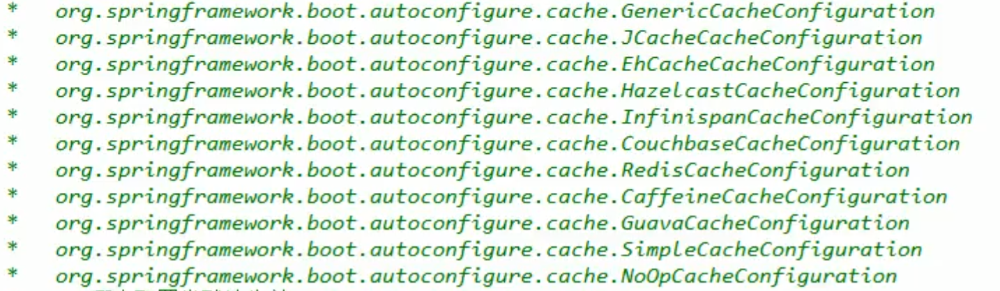
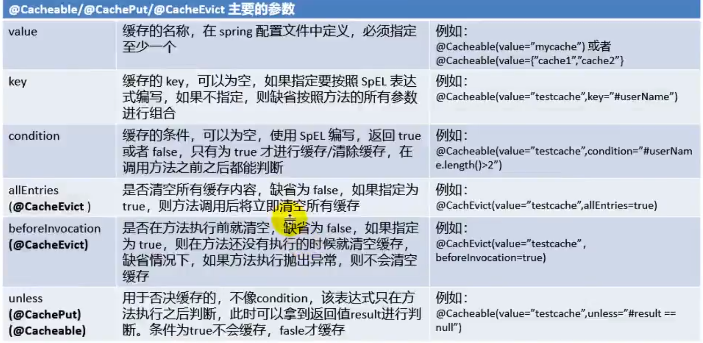

# 一、Spring Boot 入门

统一环境：

## 1、MAVEN设置：

给maven的settings.xml配置文件中

```java
  <profile>  
     <id>jdk-1.8</id>  
     <activation>  
      <activeByDefault>true</activeByDefault>  
      <jdk>1.8</jdk>  
     </activation>  
     <properties>  
      <maven.compiler.source>1.8</maven.compiler.source>  
      <maven.compiler.target>1.8</maven.compiler.target>  
      <maven.compiler.compilerVersion>1.8</maven.compiler.compilerVersion>  
     </properties>  
 </profile>
```

## 2、SpringBoot HelloWorld

一个功能：

浏览器发送hello请求，服务器接受请求并处理，相应Hello  World字符串

### 1.创建一个maven工程；

### 2.导入springboot 相关的依赖

```xml
    <parent>
        <groupId>org.springframework.boot</groupId>
        <artifactId>spring-boot-starter-parent</artifactId>
        <version>1.5.9.RELEASE</version>
    </parent>

    <dependencies>
        <dependency>
            <groupId>org.springframework.boot</groupId>
            <artifactId>spring-boot-starter-web</artifactId>
        </dependency>

    </dependencies>
```

### 3、编写一个主程序

### 4、编写相关的Controller、Service

### 5、运行主程序测试

### 6、简化部署

## 3、HelloWorld探究

### 1、POM文件

#### 1、父项目

```xml
    <parent>
        <groupId>org.springframework.boot</groupId>
        <artifactId>spring-boot-starter-parent</artifactId>
        <version>1.5.9.RELEASE</version>
    </parent>
他来真正管理spring boot 应用的里面的所有的依赖版本
```

Spring  Boot的版本仲裁中心

以后我们导入依赖默认是不需要写版本的；

#### 2、导入的依赖

```xml
  <dependency>
            <groupId>org.springframework.boot</groupId>
            <artifactId>spring-boot-starter-web</artifactId>
        </dependency>
```

spring-boot-starter-web:

​		spring-boot-start:Spring boot 场景启动器; 帮我们导入了web模块正常运行所依赖的组件

​		spring Boot 将所有的功能都抽取出来，做成一个个的starters启动器 ，只需要再项目里引入这些starter相关场景的依赖都会导入进来。而且版本由spring boot仲裁控制。要用什么功能就导入什么场景的启动器。

### 2、主程序类，主入口类

```java
/**
 * @SpringBootApplication 来标注一个主程序类，说明这是一个spring boot应用
 */
@SpringBootApplication
public class HelloWorldMainApplication {
    public static void main(String args[]){
        //Spring应用启动起来
        SpringApplication.run(HelloWorldMainApplication.class,args);


    }
}

```

@SpringBootApplication: Spring Boot

应用标注再某个类上说明这个类是SpringBoot的主配置类 Spring Boot 就应该运行这个方法来启动Spring Boot应用

```java
@Target({ElementType.TYPE})
@Retention(RetentionPolicy.RUNTIME)
@Documented
@Inherited
@SpringBootConfiguration
@EnableAutoConfiguration
@ComponentScan(
    excludeFilters = {@Filter(
    type = FilterType.CUSTOM,
    classes = {TypeExcludeFilter.class}
), @Filter(
    type = FilterType.CUSTOM,
    classes = {AutoConfigurationExcludeFilter.class}
)}
)
```

@**SpringBootConfiguration**：Spring Boot 配置类 

​	标注在某个类上，表示这是一个Spring Boot的配置类

​	@**Configuration**:配置类上来标注这个注解

​			配置类 --- 配置文件 ； 配置类也是容器中的一个组件

@**EnableAutoConfiguration**:开启自动配置功能；告诉Spring Boot 开启自动配置功能，这样自动配置才能生效；

~~~java
@AutoConfigurationPackage
@Import({EnableAutoConfigurationImportSelector.class})
public @interface EnableAutoConfiguration {
~~~

@**AutoConfigurationPackage**:自动配置包

​	@**Import**({Registrar.class})

​	Spring的底层注解@**Import**，给容器中导入一个组件；导入的组件由Registrar.class

​	**将主配置类（@SpringBootAppliction标注的类）的所在包及下面所有子包里面的所有组件扫描到Sring容器中`**

```java
@Import({EnableAutoConfigurationImportSelector.class})
```

给容器中导入组件

EnableAutoConfigurationImportSelector:导入组件选择器

将所有需要导入的组件以全类名的方式返回；这些组件就会被添加到容器中；

会给容器中导入非常多的自动配置类(xxxAutoConfiguration);就是给容器中导入这个场景所需要的所有组件，并配置好这些组件。

## 4、使用Spring Initalizer快速创建Spring Boot项目

IDE都智齿使用Spring Boot的项目创建向导快速创建一个Spring Boot项目：

选择我们需要的模块；想到会联网创建项目模板

默认生成的Spring Boot 项目

- 主程序已经生成好了
- resources文件夹中目录结构
  - static：保存所有的静态资源：JS CSS Image;
  - templates:保存所有的模板页面；（Spring Boot默认jar包使用嵌入式的Tomcat，默认不支持JSP页面）；可以使用模板引擎（freemarker，thymeleaf)
  - application.properties: Spring Boot应用的配置文件；
    - 比如修改一下 tomcat的端口号：server.port:8081

# 二、配置文件

## 1、配置文件

SpringBoot使用的一个全局的配置文件、配置文件的名是固定的

appliaction.properties

appliction.yml

配置文件的作用:修改SpringBoot启动配置的默认值；SpringBoot在底层都给我们自动配置好了


YAML（YAML Ain't Markup Language）

​		YAML 是一个标记语言

​		YAML 不是一个标记语言

标记语言: 

​	以前的配置文件，大多都使用的是 xxx.xml文件；

​	YAML以数据为中心，比json，xml等更适合配置文件

​	YAML：配置实例

~~~yaml
server:
  port: 8081


~~~

​	XML:

```xml
<server>
    <port>8081</port>
</server>


```

## 2、YAML语法

### 1、基本语法

k:(空格)v :表示一堆键值对（空格必须有）

以空格的缩进来控制层级关系：只要是左对齐的一列数据，都是一个层级的

~~~yaml
server:
  port: 8081
  path: /hello


~~~

属性和值也是大小写敏感


### 2、值的写法

#### 字面量：普通的值（数字 字符串 布尔）

​	k: v : 字面直接来写；

​			字符串默认不需要加上单引号或者双引号

​			双引号：不会转义字符串的特殊字符；特殊字符会作为其本身想表示的意思

​					name:"zhangsan \n list"输出：zhangsan 换行 list

​			单引号：'zhangsan \n list' 输出：zhangsan \n list

#### 对象、Map:

​	k: v :在下一行写对象的属性和值的关系；注意缩进。

​		对象还是k: v 的方式

~~~yaml
friends: 
	lastName: zhangsan
	age: 20


~~~

​	行内写法：

~~~~yaml
fridens: {lastName: zhangsan,age: 18}


~~~~


#### 数组(List、Set)

用- 值 表示数组中的一个元素

~~~~yaml
pets:
 - cat
 - dog
 - plg


~~~~

行内写法

~~~~yaml
pets:[cat,dot,plg]


~~~~

## 3、配置文件值注入

### 1、properti配置文件在idea中默认为utf-8可能会存在乱码问题



### 2、@value获取值和@configurationProperties

|              | @ConfigurationProperties | @Value       |
| ------------ | ------------------------ | ------------ |
| 功能         | 批量注入配置文件中的属性 | 一个个的指定 |
| 松散绑定     | 支持                     | 不支持       |
| SpEL         | 不支持                   | 支持         |
| JSR303校验   | 支持                     | 不支持       |
| 复杂类型封装 | 支持                     | 不支持       |

配置文件yml还是properties他们都能获取到值。

如果说，我们只是在某个业务逻辑中需要获取一下配置文件中的某项值，我们就使用@value

如果是，我们专门写了一个javaBean来和配置文件进行映射，我们就直接使用@ConfigurationProperties

### 3、配置文件注入值数据校验


### 4、@PropertySource&@ImportResource

@PropertySource:加载指定的配置文件；

配置实例； 

```java
@PropertySource(value = {"classpath:person.properties"})
@ConfigurationProperties(prefix = "person")


```

~~~yaml
person.last-name=李四
person.birth=2017/12/12
person.age=18
person.maps.k1=v1
person.maps.k2=v2
person.dog.name=dog
person.lists=a,b,c


~~~

@ImportResource：导入Spring的配置文件，让配置文件里面的内容生效；

Spring Boot里面没有Spring的配置文件，我们自己编写的配置文件，也不能自动识别；

想让Spring的配置文件生效，加载进来；**@ImportResource** 标注在一个配置类上

```java
@SpringBootApplication@ImportResource(locations = {"classpath:beans.xml"})
导入Spring的配置文件让其生效


```


不来编写Spring的配置文件

~~~~xml
<?xml version="1.0" encoding="UTF-8"?>
<beans xmlns="http://www.springframework.org/schema/beans"
       xmlns:xsi="http://www.w3.org/2001/XMLSchema-instance"
       xsi:schemaLocation="http://www.springframework.org/schema/beans http://www.springframework.org/schema/beans/spring-beans.xsd">

    <bean id="helloService" class="com.minidwep.springboot.service.HelloService"></bean>
</beans>


~~~~

SpringBoot推荐给容器中添加组件的方式：推荐使用全注解的方式

1、配置类 ====== Spring配置文件

2、使用@Bean给容器中添加组件

~~~~java
@Configuration
public class MyAppConfig {

    //将方法的返回值添加到容器中，容器中这个组件默认的id就是方法名

    @Bean
    public HelloService helloService(){
        return new HelloService();
    }
}


~~~~


## 4、配置文件占位符

### 1、随机数

~~~~java
#{random.value}、#{random.int}、#{radom.long}
#{random.int(10)}、#{random.int[1024,65536]}


~~~~

### 2、占位符获取之前配置的值，如果没有可以用：指定默认值

~~~properties
person.dog.name=${person.last-name: hello}_dog


~~~

## 5、Profile

### 1、多Profile文件

我们在主配置文件编写的时候，文件名可以是 appliction-{profile}.properties/yml

默认使用 application.properties的配置；


### 2、yml支持多文档的方式

~~~~yaml
server:
  port: 8081
spring:
  profiles:
    active: dev
---
server:
  port: 8083
spring:
  profiles: dev
---
server:
  port: 8084
spring:
  profiles: prod  #指定属于哪个环境


~~~~


### 3、激活指定的profile

1、在默认配置文件中添加

2、Spring.profiles.active=dev

​		java-jar spring- boot-02-config-0.0.1-SNAPSHOT.jar -- spring.profiles.active=dev；

​		可以直接在测试的时候，配置传入命令行

3、虚拟机参数

​		-Dspring.profiles.active=dev

## 6、配置文件加载位置

springboot启动会扫描以下位置的application.properties或者application.yml文件作为SpringBoot的默认配置文件

-file: ./config/

-file: ./

-classpath: /config/

-classspath: /

优先级由高到底，高优先级的配置会覆盖低优先级的配置；

SpringBoot会从这四个位置全部配置主配置文件;互补配置；

我们还可以通过spring.config.location 来改变默认的配置文件位置

## 7、外部配置加载顺序

## 8、自动配置原理

配置文件到底能写什么？怎么写？自动配置的原理

配置文件配置的属性参照


### 1、自动配置的原理：

1、spirngboot启动的时候加载主配置类，开启了自动配置功能@EnableAutoConfiguration

2、@EnableAutoConfiguration的作用

- 利用@Import({AutoConfigurationImportSelector.class})给容器中导入一些组件

- 可以查看selectImports中的内容

- List<String> configurations = this.getCandidateConfigurations(annotationMetadata, attributes); 获取候选的配置

  - ~~~~java
    SpringFactoriesLoader.loadFactoryNames()
    扫描所有jar包类路径下
    把扫描到的这些文件的内容包装成properties对象
    从properties中获取到EnableAutoConfiguration.class类（类名）队形的值，然后把他们添加到容器中
        
    
    
    
    ~~~~

  - 

  将类路径下 META-INF/spring.factories里面的配置的所有EnableAutoConfiguration的值加入到了容器中 

  ~~~~JAVA
  org.springframework.boot.autoconfigure.EnableAutoConfiguration=\
  org.springframework.boot.autoconfigure.admin.SpringApplicationAdminJmxAutoConfiguration,\
  org.springframework.boot.autoconfigure.aop.AopAutoConfiguration,\
  org.springframework.boot.autoconfigure.amqp.RabbitAutoConfiguration,\
  org.springframework.boot.autoconfigure.batch.BatchAutoConfiguration,\
  org.springframework.boot.autoconfigure.cache.CacheAutoConfiguration,\
  org.springframework.boot.autoconfigure.cassandra.CassandraAutoConfiguration,\
  org.springframework.boot.autoconfigure.cloud.CloudServiceConnectorsAutoConfiguration,\
  org.springframework.boot.autoconfigure.context.ConfigurationPropertiesAutoConfiguration,\
  org.springframework.boot.autoconfigure.context.MessageSourceAutoConfiguration,\
  org.springframework.boot.autoconfigure.context.PropertyPlaceholderAutoConfiguration,\
  org.springframework.boot.autoconfigure.couchbase.CouchbaseAutoConfiguration,\
  org.springframework.boot.autoconfigure.dao.PersistenceExceptionTranslationAutoConfiguration,\
  org.springframework.boot.autoconfigure.data.cassandra.CassandraDataAutoConfiguration,\
  org.springframework.boot.autoconfigure.data.cassandra.CassandraReactiveDataAutoConfiguration,\
  org.springframework.boot.autoconfigure.data.cassandra.CassandraReactiveRepositoriesAutoConfiguration,\
  org.springframework.boot.autoconfigure.data.cassandra.CassandraRepositoriesAutoConfiguration,\
  org.springframework.boot.autoconfigure.data.couchbase.CouchbaseDataAutoConfiguration,\
  org.springframework.boot.autoconfigure.data.couchbase.CouchbaseReactiveDataAutoConfiguration,\
  org.springframework.boot.autoconfigure.data.couchbase.CouchbaseReactiveRepositoriesAutoConfiguration,\
  org.springframework.boot.autoconfigure.data.couchbase.CouchbaseRepositoriesAutoConfiguration,\
  org.springframework.boot.autoconfigure.data.elasticsearch.ElasticsearchAutoConfiguration,\
  org.springframework.boot.autoconfigure.data.elasticsearch.ElasticsearchDataAutoConfiguration,\
  org.springframework.boot.autoconfigure.data.elasticsearch.ElasticsearchRepositoriesAutoConfiguration,\
  org.springframework.boot.autoconfigure.data.elasticsearch.ReactiveElasticsearchRepositoriesAutoConfiguration,\
  org.springframework.boot.autoconfigure.data.elasticsearch.ReactiveRestClientAutoConfiguration,\
  org.springframework.boot.autoconfigure.data.jdbc.JdbcRepositoriesAutoConfiguration,\
  org.springframework.boot.autoconfigure.data.jpa.JpaRepositoriesAutoConfiguration,\
  org.springframework.boot.autoconfigure.data.ldap.LdapRepositoriesAutoConfiguration,\
  org.springframework.boot.autoconfigure.data.mongo.MongoDataAutoConfiguration,\
  org.springframework.boot.autoconfigure.data.mongo.MongoReactiveDataAutoConfiguration,\
  org.springframework.boot.autoconfigure.data.mongo.MongoReactiveRepositoriesAutoConfiguration,\
  org.springframework.boot.autoconfigure.data.mongo.MongoRepositoriesAutoConfiguration,\
  org.springframework.boot.autoconfigure.data.neo4j.Neo4jDataAutoConfiguration,\
  org.springframework.boot.autoconfigure.data.neo4j.Neo4jRepositoriesAutoConfiguration,\
  org.springframework.boot.autoconfigure.data.solr.SolrRepositoriesAutoConfiguration,\
  org.springframework.boot.autoconfigure.data.redis.RedisAutoConfiguration,\
  org.springframework.boot.autoconfigure.data.redis.RedisReactiveAutoConfiguration,\
  org.springframework.boot.autoconfigure.data.redis.RedisRepositoriesAutoConfiguration,\
  org.springframework.boot.autoconfigure.data.rest.RepositoryRestMvcAutoConfiguration,\
  org.springframework.boot.autoconfigure.data.web.SpringDataWebAutoConfiguration,\
  org.springframework.boot.autoconfigure.elasticsearch.jest.JestAutoConfiguration,\
  org.springframework.boot.autoconfigure.elasticsearch.rest.RestClientAutoConfiguration,\
  org.springframework.boot.autoconfigure.flyway.FlywayAutoConfiguration,\
  org.springframework.boot.autoconfigure.freemarker.FreeMarkerAutoConfiguration,\
  org.springframework.boot.autoconfigure.gson.GsonAutoConfiguration,\
  org.springframework.boot.autoconfigure.h2.H2ConsoleAutoConfiguration,\
  org.springframework.boot.autoconfigure.hateoas.HypermediaAutoConfiguration,\
  org.springframework.boot.autoconfigure.hazelcast.HazelcastAutoConfiguration,\
  org.springframework.boot.autoconfigure.hazelcast.HazelcastJpaDependencyAutoConfiguration,\
  org.springframework.boot.autoconfigure.http.HttpMessageConvertersAutoConfiguration,\
  org.springframework.boot.autoconfigure.http.codec.CodecsAutoConfiguration,\
  org.springframework.boot.autoconfigure.influx.InfluxDbAutoConfiguration,\
  org.springframework.boot.autoconfigure.info.ProjectInfoAutoConfiguration,\
  org.springframework.boot.autoconfigure.integration.IntegrationAutoConfiguration,\
  org.springframework.boot.autoconfigure.jackson.JacksonAutoConfiguration,\
  org.springframework.boot.autoconfigure.jdbc.DataSourceAutoConfiguration,\
  org.springframework.boot.autoconfigure.jdbc.JdbcTemplateAutoConfiguration,\
  org.springframework.boot.autoconfigure.jdbc.JndiDataSourceAutoConfiguration,\
  org.springframework.boot.autoconfigure.jdbc.XADataSourceAutoConfiguration,\
  org.springframework.boot.autoconfigure.jdbc.DataSourceTransactionManagerAutoConfiguration,\
  org.springframework.boot.autoconfigure.jms.JmsAutoConfiguration,\
  org.springframework.boot.autoconfigure.jmx.JmxAutoConfiguration,\
  org.springframework.boot.autoconfigure.jms.JndiConnectionFactoryAutoConfiguration,\
  org.springframework.boot.autoconfigure.jms.activemq.ActiveMQAutoConfiguration,\
  org.springframework.boot.autoconfigure.jms.artemis.ArtemisAutoConfiguration,\
  org.springframework.boot.autoconfigure.groovy.template.GroovyTemplateAutoConfiguration,\
  org.springframework.boot.autoconfigure.jersey.JerseyAutoConfiguration,\
  org.springframework.boot.autoconfigure.jooq.JooqAutoConfiguration,\
  org.springframework.boot.autoconfigure.jsonb.JsonbAutoConfiguration,\
  org.springframework.boot.autoconfigure.kafka.KafkaAutoConfiguration,\
  org.springframework.boot.autoconfigure.ldap.embedded.EmbeddedLdapAutoConfiguration,\
  org.springframework.boot.autoconfigure.ldap.LdapAutoConfiguration,\
  org.springframework.boot.autoconfigure.liquibase.LiquibaseAutoConfiguration,\
  org.springframework.boot.autoconfigure.mail.MailSenderAutoConfiguration,\
  org.springframework.boot.autoconfigure.mail.MailSenderValidatorAutoConfiguration,\
  org.springframework.boot.autoconfigure.mongo.embedded.EmbeddedMongoAutoConfiguration,\
  org.springframework.boot.autoconfigure.mongo.MongoAutoConfiguration,\
  org.springframework.boot.autoconfigure.mongo.MongoReactiveAutoConfiguration,\
  org.springframework.boot.autoconfigure.mustache.MustacheAutoConfiguration,\
  org.springframework.boot.autoconfigure.orm.jpa.HibernateJpaAutoConfiguration,\
  org.springframework.boot.autoconfigure.quartz.QuartzAutoConfiguration,\
  org.springframework.boot.autoconfigure.rsocket.RSocketMessagingAutoConfiguration,\
  org.springframework.boot.autoconfigure.rsocket.RSocketRequesterAutoConfiguration,\
  org.springframework.boot.autoconfigure.rsocket.RSocketServerAutoConfiguration,\
  org.springframework.boot.autoconfigure.rsocket.RSocketStrategiesAutoConfiguration,\
  org.springframework.boot.autoconfigure.security.servlet.SecurityAutoConfiguration,\
  org.springframework.boot.autoconfigure.security.servlet.UserDetailsServiceAutoConfiguration,\
  org.springframework.boot.autoconfigure.security.servlet.SecurityFilterAutoConfiguration,\
  org.springframework.boot.autoconfigure.security.reactive.ReactiveSecurityAutoConfiguration,\
  org.springframework.boot.autoconfigure.security.reactive.ReactiveUserDetailsServiceAutoConfiguration,\
  org.springframework.boot.autoconfigure.security.rsocket.RSocketSecurityAutoConfiguration,\
  org.springframework.boot.autoconfigure.security.saml2.Saml2RelyingPartyAutoConfiguration,\
  org.springframework.boot.autoconfigure.sendgrid.SendGridAutoConfiguration,\
  org.springframework.boot.autoconfigure.session.SessionAutoConfiguration,\
  org.springframework.boot.autoconfigure.security.oauth2.client.servlet.OAuth2ClientAutoConfiguration,\
  org.springframework.boot.autoconfigure.security.oauth2.client.reactive.ReactiveOAuth2ClientAutoConfiguration,\
  org.springframework.boot.autoconfigure.security.oauth2.resource.servlet.OAuth2ResourceServerAutoConfiguration,\
  org.springframework.boot.autoconfigure.security.oauth2.resource.reactive.ReactiveOAuth2ResourceServerAutoConfiguration,\
  org.springframework.boot.autoconfigure.solr.SolrAutoConfiguration,\
  org.springframework.boot.autoconfigure.task.TaskExecutionAutoConfiguration,\
  org.springframework.boot.autoconfigure.task.TaskSchedulingAutoConfiguration,\
  org.springframework.boot.autoconfigure.thymeleaf.ThymeleafAutoConfiguration,\
  org.springframework.boot.autoconfigure.transaction.TransactionAutoConfiguration,\
  org.springframework.boot.autoconfigure.transaction.jta.JtaAutoConfiguration,\
  org.springframework.boot.autoconfigure.validation.ValidationAutoConfiguration,\
  org.springframework.boot.autoconfigure.web.client.RestTemplateAutoConfiguration,\
  org.springframework.boot.autoconfigure.web.embedded.EmbeddedWebServerFactoryCustomizerAutoConfiguration,\
  org.springframework.boot.autoconfigure.web.reactive.HttpHandlerAutoConfiguration,\
  org.springframework.boot.autoconfigure.web.reactive.ReactiveWebServerFactoryAutoConfiguration,\
  org.springframework.boot.autoconfigure.web.reactive.WebFluxAutoConfiguration,\
  org.springframework.boot.autoconfigure.web.reactive.error.ErrorWebFluxAutoConfiguration,\
  org.springframework.boot.autoconfigure.web.reactive.function.client.ClientHttpConnectorAutoConfiguration,\
  org.springframework.boot.autoconfigure.web.reactive.function.client.WebClientAutoConfiguration,\
  org.springframework.boot.autoconfigure.web.servlet.DispatcherServletAutoConfiguration,\
  org.springframework.boot.autoconfigure.web.servlet.ServletWebServerFactoryAutoConfiguration,\
  org.springframework.boot.autoconfigure.web.servlet.error.ErrorMvcAutoConfiguration,\
  org.springframework.boot.autoconfigure.web.servlet.HttpEncodingAutoConfiguration,\
  org.springframework.boot.autoconfigure.web.servlet.MultipartAutoConfiguration,\
  org.springframework.boot.autoconfigure.web.servlet.WebMvcAutoConfiguration,\
  org.springframework.boot.autoconfigure.websocket.reactive.WebSocketReactiveAutoConfiguration,\
  org.springframework.boot.autoconfigure.websocket.servlet.WebSocketServletAutoConfiguration,\
  org.springframework.boot.autoconfigure.websocket.servlet.WebSocketMessagingAutoConfiguration,\
  org.springframework.boot.autoconfigure.webservices.WebServicesAutoConfiguration,\
  org.springframework.boot.autoconfigure.webservices.client.WebServiceTemplateAutoConfiguration
  
  
  
  ~~~~

  每一个这样的 xxxAutoConfiguration类都是容器中的一个组件，都加入到容器中；用它们来做自动配置

  3、每一个自动配置类进行自动配置的功能；

  4、以**HttpEncodingAutoConfiguration**为例来解释自动配置的原理：

  ~~~~java
  @Configuration(  //表示这是一个配置类，以前编写的配置文件一样，也可以给容器中添加组件
      proxyBeanMethods = false
  )
  @EnableConfigurationProperties({HttpProperties.class})//启动指定类的ConfigurationProperties功能；并把EnableConfigurationProperties加入到springboot的容器中
  @ConditionalOnWebApplication(
      type = Type.SERVLET //@spring底层@conditional注解，根据不同的条件，如果满足指定的条件，整个配置类里面的配置就会生效；判断当前应用是否是web应用
  )
  @ConditionalOnClass({CharacterEncodingFilter.class}) //判断当前项目有没有这个类CharacterEncodingFilter；Springmvc中进行乱码解决的过滤器
  @ConditionalOnProperty( //判断配置文件中是否存在某个配置。spring.http.encoding.enabled；如果不存在判断也是存在的。
      //即使配置文件中不配置spring.http.encoding.enabled=true也是默认生效的
      prefix = "spring.http.encoding",
      value = {"enabled"},
      matchIfMissing = true
  )
  public class HttpEncodingAutoConfiguration {
      //它已经和springboot的配置文件映射了
         private final Encoding properties;
      
      //只有一个有参构造器的情况下，这个参数的值就会从容器中拿
       public HttpEncodingAutoConfiguration(HttpProperties properties) {
          this.properties = properties.getEncoding();
      }
      
  
  
      
      @Bean  //给容器中添加一个组件 这个组建的某些值 需要从properties中获取
      @ConditionalOnMissingBean
      public CharacterEncodingFilter characterEncodingFilter() {
          CharacterEncodingFilter filter = new OrderedCharacterEncodingFilter();
          filter.setEncoding(this.properties.getCharset().name());
          filter.setForceRequestEncoding(this.properties.shouldForce(org.springframework.boot.autoconfigure.http.HttpProperties.Encoding.Type.REQUEST));
          filter.setForceResponseEncoding(this.properties.shouldForce(org.springframework.boot.autoconfigure.http.HttpProperties.Encoding.Type.RESPONSE));
          return filter;
      }
  
  
  
  ~~~~

  根据当前不同的条件判断，决定这个配置类是否生效？

  

  一但这个配置类生效；这个配置类就会给容器中添加各种组件；这些组件的属性是从对应的properties类中获取的，这些类里面的每一个属性又是和配置文件绑定的；

  5、所有的配置文件中配置的属性都是在xxxProperties类中封装这，配置文件能配置什么就可以参照某个功能对应的这个属性类

  ~~~~java
  @ConfigurationProperties( 
      prefix = "spring.http"//从配置文件中获取指定的值和bean的属性进行绑定
  )
  public class HttpProperties {
      private boolean logRequestDetails;
  
  
  
  ~~~~

  精髓：

  ​	**1、springboot启动会加载大量的自动配置类**

  ​	**2、我们需要的功能有没有springboot写好的自动配置类**

  ​	**3、我们再来看这个配置类中到底配置了那些组件；只要我们要用的组件有，我们就不需要再来配置了**

  ​	**4、给容器中自动配置类添加组件的时候，会从properties类中获取某些属性，我们就可以在配置文件中指定这些属性的值；**

  

  xxxxAutoConfiguration：自动配置类；

  给容器中添加组件

  xxxxPropertties:封装配置文件中的相关属性。

  

  ### 2、细节

  

  1、@Conditional派生注解(Spring注解版原生@Conditional作用)

  作用: 必须是@Conditional指定的条件成立，才给容器中添加组件，配置里面的所有内容才生效；

  

  **自动配置类必须在一定的条件下才能生效：**

我们怎么知道那些自动配置类生效了

​	在配置文件中开启springboot的debug模式

​	debug=true

​	让控制台打印自动配置报告

# 三、日志

## 1、日志框架

小张：开发已给大型系统；

​	1、System.out.println("")；将关键数据打印在控制台；去掉？

​	2、框架来记录系统的一些运行时信息；日志框架；zhanglogging.jar；

​	3、高大上的几个功能？异步模式？自动归档？。。。。？zhanglogging-good.jar；

​	4、将以前的框架卸下来？换上新的框架，需要修改之前的API;zhanglogging-perfecr.jar;

​	5、JDBC---数据库驱动；

​			写了一个统一的接口层；日志门面（日志的一个抽象层）；logging-abstract.jar；

​			给项目中导入具体的日志实现就行了； 我们之前的日志框架都是实现的抽象层；


市面上的日志框架：

​	JUL、JCL、Jboss-logging、logback、log4j、log4j2

| 日志门面（抽象层）                              | 日志实现                        |
| :---------------------------------------------- | ------------------------------- |
| ~~JCL~~         SLE4j         ~~jboss-logging~~ | JUL、**logback**、log4j、log4j2 |

在左面选一个门面（抽象层），右面选一个实现

日志门面：SLF4j；

日志实现：logback;


SpringBoot：底层是Spring框架，spring框架默认是JCL；

​	 SpringBoot选用SLF4j和logback；


## 2、SLF4j使用

### 1、如何在系统中使用SLF4j

以后开发的时候，日志记录方法的调用，不应该直接调用日志的实现类，而是调用日志抽象层里面的方法；

应该给系统里面导入slf4j的jar和logback的实现jar

```java
import org.slf4j.Logger;
import org.slf4j.LoggerFactory;
public class HelloWorld {
    public static void main(String[] args) {    
        Logger logger = LoggerFactory.getLogger(HelloWorld.class);    
        logger.info("Hello World");  
    }}


```


每一个日志的实现框架都有自己的配置文件。使用slf4j以后，配置文件还是做成日志实现框架自己本身的配置文件；


### 2、遗留问题

a(slf4j+logback):Spring(commons-logging)、Hibernate(jboss-logging)、mybatis、xxx

统一日志记录，即使是别的框架和我一起统一使用slf4j进行输出？

  

**如何让系统中所有的日志都统一到slf4j**

1、将系统中其他日志框架排除出去；

2、用中间包来替换原有的日志框架；

3、我们导入slf4j其他的实现；


## 3、springboot日志关系

```xml
<dependency>    
    <groupId>org.springframework.boot</groupId>    
    <artifactId>spring-boot-starter</artifactId>
</dependency>


```

~~~xml
  <dependency>
      <groupId>org.springframework.boot</groupId>
      <artifactId>spring-boot-starter-logging</artifactId>
      <version>2.2.1.RELEASE</version>
      <scope>compile</scope>
    </dependency>


~~~

底层依赖关系:


总部：

​		1、springboot底层也是使用slf4j和logback的方式进行日志记录

​		2、sprngboot也把其他的日志都替换成了slf4j；

## 4、日志使用

### 	1、默认配置  has a error next day i will result it

SpringBoot默认帮我们配置好了日志；

~~~java

~~~

# 四、web开发

## 1、简介

使用SpringBoot;

1、创建springboot应用，选中我们需要的模块

2、springboot已经默认将这些场景配置好了，只需要在配置文件中指定少量的配置就可以运行起来

3、自己编写业务代码


自动配置原理：

这个场景springboot帮我们配置了什么？我们能不能修改？能修改那些配置？能不能扩展？xxxx

~~~~java
xxxAutoControgruation 来帮我们自动配置
xxxxProperties：配置类 来封装配置文件的内容


~~~~

## 2、SpringBoot对静态资源的映射规则

~~~~java
@ConfigurationProperties(prefix ="spring.resources",ignoreUnknowFields = false)
public class ResourceProperties implements ResourceLoaderAware {
    //可以设置和资源有关的参数，缓存时间等


~~~~


~~~java
   public void addResourceHandlers(ResourceHandlerRegistry registry) {
            if (!this.resourceProperties.isAddMappings()) {
                logger.debug("Default resource handling disabled");
            } else {
                Duration cachePeriod = this.resourceProperties.getCache().getPeriod();
                CacheControl cacheControl = this.resourceProperties.getCache().getCachecontrol().toHttpCacheControl();
                if (!registry.hasMappingForPattern("/webjars/**")) {
                    this.customizeResourceHandlerRegistration(registry.addResourceHandler(new String[]{"/webjars/**"}).addResourceLocations(new String[]{"classpath:/META-INF/resources/webjars/"}).setCachePeriod(this.getSeconds(cachePeriod)).setCacheControl(cacheControl));
                }

                String staticPathPattern = this.mvcProperties.getStaticPathPattern();
                if (!registry.hasMappingForPattern(staticPathPattern)) {
                    this.customizeResourceHandlerRegistration(registry.addResourceHandler(new String[]{staticPathPattern}).addResourceLocations(WebMvcAutoConfiguration.getResourceLocations(this.resourceProperties.getStaticLocations())).setCachePeriod(this.getSeconds(cachePeriod)).setCacheControl(cacheControl));
                }

            }
        }
	//配置欢迎页映射
   @Bean
        public WelcomePageHandlerMapping welcomePageHandlerMapping(ApplicationContext applicationContext, FormattingConversionService mvcConversionService, ResourceUrlProvider mvcResourceUrlProvider) {
            WelcomePageHandlerMapping welcomePageHandlerMapping = new WelcomePageHandlerMapping(new TemplateAvailabilityProviders(applicationContext), applicationContext, this.getWelcomePage(), this.mvcProperties.getStaticPathPattern());
            welcomePageHandlerMapping.setInterceptors(this.getInterceptors(mvcConversionService, mvcResourceUrlProvider));
            return welcomePageHandlerMapping;
        }


~~~


1、所有webjars/** ， 都去 classpath:/META-INF/resources/webjars/ 找资源；

​	webjars：以jar包的方式引入静态资源




localhost:8080/webjars/jquery3.3.1/jquery.js


~~~xml
      <dependency>
          在访问的时候 只需要写webjars下面资源的名称即可
            <groupId>org.webjars</groupId>
            <artifactId>jquery</artifactId>
            <version>3.3.1</version>
        </dependency>


~~~

2、 “/**” 访问当前项目的任何资源（静态资源文件夹）

~~~java
"classpath:/META-INF/resources/"
"classpath:/resources/"
"classpath:/static/"
"classpath:/public"    
 "/":当前项目的根路径
     


~~~

localhost:8080/adb.xx

3、欢迎页：静态资源文件夹下的所有index.html页面；被”/**“映射

localhost：8080 默认会找index.html

4、图片： **/favicon.ico

## 3、模板引擎

JSP、Velocity、Freemarker、Thymeleaf

Springboot推荐Thymeleaf；

语法更简单，功能更强大；


### 1、引入thymeleaf

~~~xml
  <dependency>
            <groupId>org.springframework.boot</groupId>
            <artifactId>spring-boot-starter-thymeleaf</artifactId>
        </dependency>


~~~

### 2、Thymeleaf使用&语法

~~~~java
@ConfigurationProperties(
    prefix = "spring.thymeleaf"
)
public class ThymeleafProperties {
    private static final Charset DEFAULT_ENCODING;
    public static final String DEFAULT_PREFIX = "classpath:/templates/";
    public static final String DEFAULT_SUFFIX = ".html";
    private boolean checkTemplate = true;
    private boolean checkTemplateLocation = true;
    private String prefix = "classpath:/templates/";
    private String suffix = ".html";
    private String mode = "HTML";
    //只要我们把html页面 放在classpath:/templates/  thymeleaf就可以自动渲染了


~~~~

只要我们把HTML页面放在classpath:templates文件夹下

1、导入命名空间

~~~~html
<html xmlns:th="http://www.thymeleaf.org">


~~~~

2、使用thymeleaf语法

~~~~html
<!DOCTYPE html>
<html xmlns:th="http://www.thymeleaf.org">

<html lang="en">
<head>
    <meta charset="UTF-8">
    <title>Title</title>
</head>
<body>
    <h1>成功</h1>
    <!--将div文本的内容设置为-->
    <div th:text="${hello }"> </div>
</body>
</html>


~~~~

### 3、语法规则

1、th:text:改变当前元素里面的文本内容；



2、表达式

~~~~properties
Simple expressions:
	Variable Expressions: ${...} 
		1、获取对象的属性、调用对象
		2、使用内置的基本对象
			#ctx : the context object. 
			#vars: the context variables. 
			#locale : the context locale. 
			#request : (only in Web Contexts) the HttpServletRequest object. 
			#response : (only in Web Contexts) the HttpServletResponse object. 
			#session : (only in Web Contexts) the HttpSession object. 
			#servletContext : (only in Web Contexts) the ServletContext object.

		3、内置的一些工具对象
		#execInfo : information about the template being processed. 
        #messages : methods for obtaining externalized messages inside variables 		expressions, in the same way as they would be obtained using #{…} syntax. 
        #uris : methods for escaping parts of URLs/URIs
        Page 20 of 106
        #conversions : methods for executing the configured conversion service (if any). 
        #dates : methods for java.util.Date objects: formatting, component extraction, 	etc. 
        #calendars : analogous to #dates , but for java.util.Calendar objects. 
        #numbers : methods for formatting numeric objects. 
        #strings : methods for String objects: contains, startsWith, prepending/appending, etc. #objects : methods for objects in general. 
        #bools : methods for boolean evaluation. 
        #arrays : methods for arrays. 
        #lists : methods for lists. 
        #sets : methods for sets. 
        #maps : methods for maps. 
        #aggregates : methods for creating aggregates on arrays or collections. 
        #ids : methods for dealing with id attributes that might be repeated (for example, as a result of an iteration).

    Selection Variable Expressions: *{...} 
    	补充：配合 th:object="${}" 进行使用
    	  <div th:object="${session.user}">    
    	  <p>Name: <span th:text="*{firstName}">Sebastian</span>.</p>    
    	  <p>Surname: <span th:text="*{lastName}">Pepper</span>.</p>    
    	  <p>Nationality: <span th:text="*{nationality}">Saturn</span>.</p>  
    	  </div
	Message Expressions: #{...} 获取国际化内容
	Link URL Expressions: @{...} 定义url链接的
	Fragment Expressions: ~{...} 片段引用表达式
Literals （字面量）
	Text literals: 'one text' , 'Another one!' ,… Number literals: 0 , 34 , 3.0 , 12.3 ,… 	Boolean literals: true , false Null literal: null Literal tokens: one , sometext , main 	,…
Text operations （文本操作）: 
	String concatenation: + Literal substitutions: |The name is ${name}|
Arithmetic operations（数学运算）:
	Binary operators: + , - , * , / , % 
	Minus sign (unary operator): 
Boolean operations（布尔运算）:
	Binary operators: and , or 
	Boolean negation (unary operator): ! , not
Comparisons and equality（比较运算）:
	Comparators: > , < , >= , <= ( gt , lt , ge , le ) 
	Equality operators: == , != ( eq , ne )
Conditional operators(条件运算):
    If-then: (if) ? (then) 
    If-then-else: (if) ? (then) : (else) 
    Default: (value) ?: (defaultvalue)
Special tokens:
Page 17 of 106
No-Operation: _


~~~~

## 4、springMVC的自动配置

### 1、Spring MVC Auto-configuration

springboot自动配置好了springMVC

Spring Boot provides auto-configuration for Spring MVC that works well with most applications.
The auto-configuration adds the following features on top of Spring’s defaults:

以下是springboot对springmvc的默认配置：

- • Inclusion of `ContentNegotiatingViewResolver` and `BeanNameViewResolver beans`.

  - 自动配置了ViewResolver(试图解析器：根据方法的返回值得到视图对象（View），视图对象决定如何渲染（转发?重定向？）)
  - ContentNegotiatingViewResolver：组合所有的视图解析器；
  - 如何定制：我们可以自己给容器中添加一个视图解析器；自动的将其组合进来

- • Support for serving static resources, including support for WebJars (covered later in this document)). 

  - 静态资源文件夹路径

- • Automatic registration of Converter, GenericConverter, and Formatter beans.

  - 自动注册了 Converter，GenericConverter、Formatter 对象

  - Converter：转换器  类型转化使用Converter

  - Formatter：格式化器 2017.12.12 => data

    自己添加的格式转化器，只需要添加到容器中

- • Support for HttpMessageConverters (covered later in this document). 

  - HttpMessageConverters ：springMVC 用来转化http请求和相应的； user-json
  - HttpMessageConverters 是容器中确定的；获取所有的HttpMessageConverter;
  - 自己给容器中添加HttpMessageConverter只需要添加到容器中（@Bean，@Component)

- • Automatic registration of MessageCodesResolver (covered later in this document). 

- • Static index.html support.

  -  静态首页访问

- • Custom Favicon support (covered later in this document). 

  - 图标

- • Automatic use of a ConfigurableWebBindingInitializer bean (covered later in this document).
  If you want to keep Spring Boot MVC features and you want to add additional MVC configuration (interceptors, formatters, view controllers, and other features), you can add your own @Configuration class of type WebMvcConfigurer but without @EnableWebMvc. If you wish to provide custom instances of RequestMappingHandlerMapping, RequestMappingHandlerAdapter, or ExceptionHandlerExceptionResolver, you can declare a WebMvcRegistrationsAdapter instance to
  89
  provide such components.
  If you want to take complete control of Spring MVC, you can add your own @Configuration annotated with @EnableWebMvc.

### 2、扩展SpringMVC

~~~~xml
<mvc:view-controller path="/hello" view-name="success"/>
<mvc:interceptors>
	<mvc:interceptor>
    	<mvc:mapping path="/hello"></mvc:mapping>
        <bean></bean>
    </mvc:interceptor>
</mvc:interceptors>


~~~~

**编写一个配置类(@Configuration)，是 WebMvcConfigurer 类型；不能标注@EnableWebMvc**


~~~~java
@Configuration
public class MyMvcConfig implements WebMvcConfigurer {
}


~~~~

原理：

1、webMvcAutoConfiguration是SpringMVC的自动配置类

2、在做其它自动配置时会导入；import（EnableWebMvcConfiguration.class）

3、容器中所有的EnableWebMvcConfigurer都会一起起作用

3、我们的配置类也会被调用

效果：SpringMVC的自动配置和我们的扩展配置都会起作用


### 3、全面接管SpringMVC

SpringBoot对SpringMVC的自动配置不需要了，所有都是我们自己配置；

我们需要配置类中添加 @EnableWebMvc 注解


## 5、如何修改SpringBoot的默认配置


## 6、RestfulCRUD

### 1、默认访问首页

~~~~java
@Configuration
//@EnableWebMvc
public class MyMvcConfig implements WebMvcConfigurer {
    @Override
    public void addViewControllers(ViewControllerRegistry registry) {
        registry.addViewController("/").setViewName("index");
        registry.addViewController("/index.html").setViewName("index");
    }


~~~~


或者配置Controller

~~~~java
    @RequestMapping({"/","/index.html"})
    public String index(){
        return "index";
    }


~~~~

### 2、国际化

**1、编写国际化配置文件**

2、使用ResourceBundleMessageSource管理国际化资源文件

3、在页面使用fmt:message 取出国际化的内容


步骤：

1、编写国际化配置文件，抽取页面需要显示的国际化消息



2、SpringBoot自动配置好了管理国际化资源文件的组件

~~~~java
 @Bean
    @ConfigurationProperties(
        prefix = "spring.messages"
    )
//我们配置文件可以直接放在类路径下叫messgae.properties

    public MessageSourceProperties messageSourceProperties(){
        
    }
 @Bean
    public MessageSource messageSource(MessageSourceProperties properties) {
        ResourceBundleMessageSource messageSource = new ResourceBundleMessageSource();
        if (StringUtils.hasText(properties.getBasename())) {
           //设置国际化资源文件的基础名（去掉国家代码的）
            messageSource.setBasenames(StringUtils.commaDelimitedListToStringArray(StringUtils.trimAllWhitespace(properties.getBasename())));
        }

        if (properties.getEncoding() != null) {
            messageSource.setDefaultEncoding(properties.getEncoding().name());
        }

        messageSource.setFallbackToSystemLocale(properties.isFallbackToSystemLocale());
        Duration cacheDuration = properties.getCacheDuration();
        if (cacheDuration != null) {
            messageSource.setCacheMillis(cacheDuration.toMillis());
        }

        messageSource.setAlwaysUseMessageFormat(properties.isAlwaysUseMessageFormat());
        messageSource.setUseCodeAsDefaultMessage(properties.isUseCodeAsDefaultMessage());
        return messageSource;
    }


~~~~

3、去页面获取国际化的值

~~~html
<!DOCTYPE html>
<html xmlns:th="http://www.thymeleaf.org">
<html lang="en">
	<head>
		<meta http-equiv="Content-Type" content="text/html; charset=UTF-8">
		<meta name="viewport" content="width=device-width, initial-scale=1, shrink-to-fit=no">
		<meta name="description" content="">
		<meta name="author" content="">
		<title>Signin Template for Bootstrap</title>
		<!-- Bootstrap core CSS -->
		<link   th:href="@{/webjars/bootstrap/4.0.0/css/bootstrap.css }" rel="stylesheet">
		<!-- Custom styles for this template -->
		<link th:href="@{asserts/css/signin.css }" rel="stylesheet">
	</head>

	<body class="text-center">
		<form class="form-signin" action="dashboard.html">
			
			<h1 class="h3 mb-3 font-weight-normal" th:text="#{login.tip }"></h1>
			<label class="sr-only" th:text="#{login.username }"></label>
			<input type="text" class="form-control" placeholder="Username" required="" autofocus="">
			<label class="sr-only" th:text="#{login.password }"></label>
			<input type="password" class="form-control" placeholder="Password" required="">
			<div class="checkbox mb-3">
				<label>
          <input type="checkbox" value="remember-me"> [[ #{login.remember}]]
        </label>
			</div>
			<button class="btn btn-lg btn-primary btn-block" type="submit" th:text="#{login.btn }"></button>
			<p class="mt-5 mb-3 text-muted">© 2017-2018</p>
			<a class="btn btn-sm">中文</a>
			<a class="btn btn-sm">English</a>
		</form>

	</body>

</html>


~~~

效果：根据浏览器语言切换语言


原理：

​		国际化Local（区域信息对象）；LocaleResolver(获取区域信息对象)


~~~~java
     	@Bean
        @ConditionalOnMissingBean
        @ConditionalOnProperty(
            prefix = "spring.mvc",
            name = {"locale"}
        )
        public LocaleResolver localeResolver() {
            if (this.mvcProperties.getLocaleResolver() == org.springframework.boot.autoconfigure.web.servlet.WebMvcProperties.LocaleResolver.FIXED) {
                return new FixedLocaleResolver(this.mvcProperties.getLocale());
            } else {
                AcceptHeaderLocaleResolver localeResolver = new AcceptHeaderLocaleResolver();
                localeResolver.setDefaultLocale(this.mvcProperties.getLocale());
                return localeResolver;
            }
        }
 默认的就是根据请求头来的语言来设置


~~~~

4、点击链接切换国际化

~~~~java
public class MyLocaleResolver implements LocaleResolver {
    @Override
    public Locale resolveLocale(HttpServletRequest httpServletRequest) {
        String l = httpServletRequest.getParameter("l");
        Locale locale = Locale.getDefault();
        if(!StringUtils.isEmpty(l)){
            String[] split = l.split("_");
            locale =  new Locale(split[0],split[1]);
        }
        return locale;
    }


~~~~

~~~java
  @Bean
    public LocaleResolver localeResolver(){
        return new MyLocaleResolver();
    }


~~~

### 3、登录

模板引擎修改以后，要实时生效，

1、禁用模板引擎的缓存

~~~~xml
spring.thymeleaf.cache=false


~~~~

2、页面修改完成以后 ctrl+f9 重新编译


### 4、拦截器进行登录检查

~~~java
public class LoginHandleInterceptor implements HandlerInterceptor {
    //目标方法执行之前
    @Override
    public boolean preHandle(HttpServletRequest request, HttpServletResponse response, Object handler) throws Exception {
        Object user = request.getSession().getAttribute("loginUser");
        if(user == null){
            request.setAttribute("msg","没有权限，请先登录");
//            request.getRequestDispatcher("/index.html").forward(request,response);
            System.out.println("no");
            request.getRequestDispatcher("/").forward(request,response);
            return false;
        } else {
            return true;
        }
    }

    @Override
    public void postHandle(HttpServletRequest request, HttpServletResponse response, Object handler, ModelAndView modelAndView) throws Exception {

    }

    @Override
    public void afterCompletion(HttpServletRequest request, HttpServletResponse response, Object handler, Exception ex) throws Exception {

    }
}


~~~

~~~~java
    @Override
    public void addInterceptors(InterceptorRegistry registry) {
//        静态资源 *.css *.js
//        SpringBoot已经做好了静态资源映射
        registry.addInterceptor(new LoginHandleInterceptor()).addPathPatterns("/**")
        .excludePathPatterns("/index.html","/","/user/login");
    }


~~~~

#### 关于静态资源的拦截问题

~~~~java
Spring Boot 2.x 实现WebMvcConfigurer以后会拦截静态资源，并且重写addResourceHandlers方法失效，还是会拦截静态资源。
解决方法；

// 注册拦截器
	@Override
	public void addInterceptors(InterceptorRegistry registry) {
// 静态资源 *.css *.js *.jpg... SpringBoot已经做好了对静态资源的映射，所以不会拦截静态资源了
	registry.addInterceptor(new LoginHandlerInterceptor()).addPathPatterns("/**")
	.excludePathPatterns("/login.html", "/", "/user/login","/asserts/**","/webjars/**");
	}

    @Override
    public void addResourceHandlers(ResourceHandlerRegistry registry) {
//静态文件
        registry.addResourceHandler("/**").addResourceLocations("classpath:/static/");
        registry.addResourceHandler("/**").addResourceLocations("classpath:/public/");
//webjar文件
        registry.addResourceHandler("/webjars/**").addResourceLocations("/webjars/");
    }


~~~~


### 5、CRUD-员工列表

1、RestfulCRUD：满足Rest风格

|      | 普通CRUD(uri来区分操作) | RestfulCRUD        |
| ---- | ----------------------- | ------------------ |
| 查询 | getEmp                  | emp----GET         |
| 添加 | addEmp?xxx              | emp----POST        |
| 修改 | updateEmp?id=xxx&xxx    | emp/{id}---PUT     |
| 删除 | deleteEmp?id=1          | emp/{id}----DELETE |

2、实验的Restful请求架构

|                                      | 请求的uri | 请求方式 |
| ------------------------------------ | --------- | -------- |
| 查询所有员工                         | emps      | GET      |
| 查询某个员工                         | emp/{id}  | GET      |
| 来到添加页面                         | emp       | GET      |
| 添加员工                             | emp       | POST     |
| 来到修改页面（查出员工进行信息回显） | emp/{id}  | GET      |
| 修改员工                             | emp       | PUT      |
| 删除员工                             | emp/{id}  | DELETE   |

3、员工列表：

##### Thymeleaf公共页面元素抽取

~~~html
1、抽取公共片段
 <div th:fragment="copy">      
     &copy; 2011 The Good Thymes Virtual Grocery    
</div>
2、引入公共片段
 <div th:insert="~{footer :: copy}"></div>
~{templatename::selector} 模板名::选择器
~{templatename::fragmentname} 模板名::片段名
 <div th:insert="footer :: copy"></div>
3、默认效果

insert的功能片段在div标签中


~~~

三种引入功能片段的th属性

th:insert ：将公共片段插入到整个div中

th:replace ：将生命引入的元素替换为公共片段

th:include ：将被引入的片段的内容包含进这个标签中

~~~html
<footer th:fragment="copy">  &copy; 2011 The Good Thymes Virtual Grocery </footer>


引入方式
<div th:insert="footer :: copy"></div>
<div th:replace="footer :: copy"></div>
<div th:include="footer :: copy"></div> 

效果
<div>    
      <footer>      
      &copy; 2011 The Good Thymes Virtual Grocery    
      </footer>  
</div>

<footer>    
      &copy; 2011 The Good Thymes Virtual Grocery  
</footer>

<div>    
      &copy; 2011 The Good Thymes Virtual Grocery  
</div>


~~~

### 6、CRUD-添加员工

~~~html
					<form method="post" action="emp">

						<div class="form-group">
							<label >lastName</label>
							<input name="lastName" type="text" class="form-control"  placeholder="zhangsan">
						</div>

						<div class="form-group">
							<label for="exampleFormControlInput1">email</label>
							<input name="email" type="email" class="form-control" id="exampleFormControlInput1" placeholder="name@example.com">
						</div>

						<div class="form-group">
							<label>Gender</label>
							<div class="from-check form-check-inline">
								<input class="form-check-input" type="radio" name="gender" value="1">
								<label class="form-check-label">男</label>
							</div>
							<div class="from-check form-check-inline">
								<input class="form-check-input" type="radio" name="gender" value="0">
								<label class="form-check-label">女</label>
							</div>
						</div>
						<div class="form-group">
							<label for="exampleFormControlSelect1">department</label>
							<select name="department.id" class="form-control" id="exampleFormControlSelect1">
								<option th:value="${dept.id}" th:each="dept:${depts}">[[${dept.departmentName} ]]</option>
							</select>
						</div>

						<div class="form-group">
							<label >birth</label>
							<input name="birth" type="text" class="form-control"  placeholder="zhangsan">
						</div>

						<button type="submit" class="btn btn-primary">添加</button>


					</form>


~~~

员工添加最容易引起的错误：

2012/12/12

2012-12-12 

2012.12.12

日期的格式化

SpringMVC将页面提交的值需要转化为指定格式

默认是 / 分割 2012/12/12 ---Date

### 7、CRUD-修改员工

1、开启hiddenmethod.filter

​	再配置文件中添加

~~~~properties
spring.mvc.hiddenmethod.filter.enabled=true


~~~~

2、修改post为put方式

~~~~html
	<!--1、在SpringMVC配置hiddenHttpMethodFilter;（springboot配置好了）
							2、页面创建一个post表单
							3、创建一个input项 name="_method" 值就是发送方式
	-->
<input type="hidden" name="_method" value="put" th:if="${emp!=null}"/>


~~~~

## 7、SpringBoot错误处理机制

### 1、springboot默认的错误处理机制

1、默认效果:

​	1）、返回一个默认的错误页面

~~~~html
Whitelabel Error Page
This application has no explicit mapping for /error, so you are seeing this as a fallback.

Wed Dec 04 19:19:58 CST 2019
There was an unexpected error (type=Not Found, status=404).
No message available


~~~~

浏览器请求头




​	2）、如果是其他客户端访问

~~~~json
{
    "timestamp": "2019-12-04T12:45:53.270+0000",
    "status": 404,
    "error": "Not Found",
    "message": "No message available",
    "path": "/crud/aa"
}


~~~~

其他客户端请求头



原理：

​		可以参照ErrorMvcAutoConfiguration：错误处理的自动配置

​		给容器中添加了一下组件：

​		1、BasicErrorController：处理默认/error请求

~~~java
@Controller
@RequestMapping({"${server.error.path:${error.path:/error}}"})
public class BasicErrorController extends AbstractErrorController {


~~~

~~~~java
 @RequestMapping(
        produces = {"text/html"}  //产生html类型的数据
    )
public ModelAndView errorHtml(HttpServletRequest request, HttpServletResponse response) {
        HttpStatus status = this.getStatus(request);
        Map<String, Object> model = Collections.unmodifiableMap(this.getErrorAttributes(request, this.isIncludeStackTrace(request, MediaType.TEXT_HTML)));
        response.setStatus(status.value());
    //去哪个页面作为错误页面；modelAndView 包含错误和地址
        ModelAndView modelAndView = this.resolveErrorView(request, response, status, model);
        return modelAndView != null ? modelAndView : new ModelAndView("error", model);
    }


    @RequestMapping
    public ResponseEntity<Map<String, Object>> error(HttpServletRequest request) {
        HttpStatus status = this.getStatus(request);
        if (status == HttpStatus.NO_CONTENT) {
            return new ResponseEntity(status);
        } else {
            Map<String, Object> body = this.getErrorAttributes(request, this.isIncludeStackTrace(request, MediaType.ALL));
            return new ResponseEntity(body, status); //产生json数据
        }
    }


~~~~


​		2、DefaultErrorAttributes

~~~java
帮我们在页面共享信息


~~~


​		3、ErrorPageCustomizer

~~~~java
系统出现错误以后
    @Value("${error.path:/error}")
    private String path = "/error"
    系统出现错误以后来到error请求进行处理；
    web.xml注册的错误页面规则  


~~~~


​		4、DefaultErrorViewResolver

~~~~java
private ModelAndView resolve(String viewName, Map<String, Object> model) {
   // 默认SpringBoot可以去找一个页面 error/404
        String errorViewName = "error/" + viewName;
    //模板引擎可以解析这个页面地址就用模板引擎
        TemplateAvailabilityProvider provider = this.templateAvailabilityProviders.getProvider(errorViewName, this.applicationContext);
    //模板引擎可用的情况瞎返回到errorViewName指定的视图地址
   	//模板引擎不可用。就在静态资源文件夹下找errorViewName对应的页面
        return provider != null ? new ModelAndView(errorViewName, model) : this.resolveResource(errorViewName, model);
    }

    private ModelAndView resolveResource(String viewName, Map<String, Object> model) {
        String[] var3 = this.resourceProperties.getStaticLocations();
        int var4 = var3.length;

        for(int var5 = 0; var5 < var4; ++var5) {
            String location = var3[var5];

            try {
                Resource resource = this.applicationContext.getResource(location);
                resource = resource.createRelative(viewName + ".html");
                if (resource.exists()) {
                    return new ModelAndView(new DefaultErrorViewResolver.HtmlResourceView(resource), model);
                }
            } catch (Exception var8) {
            }
        }

        return null;
    }


~~~~


步骤:

​		一旦系统出现4xx或者5xx之类的错误；ErrorPageCustomizer就会生效（定制错误的相应规则）；就会来到/error请求；就会被 BasicErrorController 处理

​		1）、响应页面：去哪个页面 是由**DefaultErrorViewResolver**

~~~~java
    protected ModelAndView resolveErrorView(HttpServletRequest request, HttpServletResponse response, HttpStatus status, Map<String, Object> model) {
        Iterator var5 = this.errorViewResolvers.iterator();

        ModelAndView modelAndView;
        do {
            if (!var5.hasNext()) {
                return null;
            }

            ErrorViewResolver resolver = (ErrorViewResolver)var5.next();
            modelAndView = resolver.resolveErrorView(request, status, model);
        } while(modelAndView == null);

        return modelAndView;
    }


~~~~


### 2、如何定制错误响应：

​	1）、如何定制错误的页面

​			1）、有模板引擎的情况下； error/状态码

​						【将错误页面命名为 错误状态码.html 放在 模板引擎/error文件夹下】

​					发生此状态码的错误就会来到对应的页面

​					我们可以使用4xx 5xx 来作为错误页面的文件名来匹配这种类型的所有错误，精确优先（优先查找 状态码.html）

​				**页面可以获得的信息**：

​					timestamp:

​					error:

​					status:

​					exception:

​					errors:JSR303

​			2）、没有模板引擎的情况下（模板引擎找不到）：在静态资源下找/error

​			3）、都没有的情况下：默认为SpringBoot的错误提示页。


​	2）、如何定制错误的JSON

​			1）、自定义异常处理&返回定制json数据；

​		方法1：

~~~~java
   @ResponseBody
    @ExceptionHandler(UserLoginException.class)
    public Map<String,Object> handleException(Exception e){

        Map<String,Object> map = new HashMap<>();
        map.put("code","user.notexist");
        map.put("message",e.getMessage());

        return map;
    }


~~~~

​		方法2：转发到/error进行自适应响应处理

~~~~java
    @ExceptionHandler(UserLoginException.class)
    public String handleException(Exception e){
        Map<String,Object> map = new HashMap<>();
        map.put("code","user.notexist");
        map.put("message",e.getMessage());
        //        传入自己的错误状态码（取代）
        request.setAttribute("javax.servlet.error.status_code",500);

//        转发到/error
        return "forword:/error";
    }


~~~~

​		方法3：定制数据携带

出现错误以后，会来到/error请求，会被BasicErrorController处理，响应出去的数据 是由getErrorAttributes

​		1、完全来编写一个一个ErrorController的实现类[或者是编写AbstractErrorController的子类]，放在容器里

​		2、页面上能用的数据，或者是json返回能用的数据 都是通过 errorAttributes.getErrorAttributes得到

容器中DefaultErrorAttributes 默认进行数据处理的

自定义 ErrorAttributes

~~~~java
@Component
public class MyErrorAttributes extends DefaultErrorAttributes {

    @Override
    public Map<String, Object> getErrorAttributes(WebRequest webRequest, boolean includeStackTrace) {
        Map<String, Object> map = super.getErrorAttributes(webRequest, includeStackTrace);
        map.put("company","minidwep");
        return map;
    }
}


~~~~

最终效果：响应是自适应的。可以通过定制ErrorAttributes改变需要返回的内容

## 8、配置嵌入式Servlet容器

SpringBoot默认使用Tomcat作为嵌入式的Servlet容器

问题？

### 	1、如何定制和修改Servlet容器的相关配置；

#### 		1）、修改和server有关的配置（ServerProperties）

~~~~properties
servet.port=8081

#通用的Servet容器设置
#server.xxx
#Tomcat的设置
#server.tomcat.xxx

server.tomcat.accesslog.encoding=utf-8


~~~~

#### 	2）、注册servlet三大组件 【Servlet Filter Listener】

由于SpringBoot默认是以jar包的方式启动嵌入式的Servlet容器来启动SpringBoot的web应用，没有web.xml文件

Servlet

~~~~java
//    注册三大组件
    @Bean
    public ServletRegistrationBean myServlet(){
        ServletRegistrationBean servletRegistrationBean = new ServletRegistrationBean(new MyServlet(),"/myServlet");
        return servletRegistrationBean;
    }


~~~~

Filter

~~~~java
    @Bean
    public FilterRegistrationBean myFilter(){
        FilterRegistrationBean filterRegistrationBean = new FilterRegistrationBean();
        filterRegistrationBean.setFilter(new MyFilter());
        filterRegistrationBean.setUrlPatterns(Arrays.asList("/hello","/myServlet"));
        return filterRegistrationBean;
    }


~~~~

Listener 

同理

SpringBoot帮我们自动配置SpringMVC的时候，自动的注册SpringMVC的前端控制器；DispatcherServlet

~~~~java
 @Bean(
            name = {"dispatcherServletRegistration"}
        )
        @ConditionalOnBean(
            value = {DispatcherServlet.class},
            name = {"dispatcherServlet"}
        )
        public DispatcherServletRegistrationBean dispatcherServletRegistration(DispatcherServlet dispatcherServlet, WebMvcProperties webMvcProperties, ObjectProvider<MultipartConfigElement> multipartConfig) {
            
            DispatcherServletRegistrationBean registration = new DispatcherServletRegistrationBean(dispatcherServlet, webMvcProperties.getServlet().getPath());
            
            //默认拦截所有请求：/ 所有请求 ；包括静态资源，但是不拦截JSP请求
            // /*会拦截jsp
            //可以通过 server.servletPath来修改拦截路径
            registration.setName("dispatcherServlet");
            registration.setLoadOnStartup(webMvcProperties.getServlet().getLoadOnStartup());
            multipartConfig.ifAvailable(registration::setMultipartConfig);
            return registration;
        }


~~~~


### 2、SpringBoot能不能支持其他的Servlet容器；

Jetty（长连接）(聊天工具）

Undertow（不支持JSP）  （非阻塞容器，高并发）

springboot默认支持切换 Jetty 和 Undertow

# 五、Docker和spring boot

## 1、简介

Docker是一个开源的应用容器引擎

Docker支持将软件编译成一个镜像；然后再镜像中各种软件做好配置；将镜像发布出去，其他使用者可以直接使用这个镜像；

运行中的这个镜像成为容器，容器启动时非常快速的。

## 2、核心概念

docker主机（host）：安装了Docker程序的机器（Docker直接安装再运行的操作系统上）

docker客户端（client）：客户端通过命令行或者其他工具使用Docker

docker仓库（resgistry）：用来保存各种打包好的软件镜像

docker镜像（Images）：软件打包好的docker镜像，放在docker仓库中

docker容器（Container）：镜像启动后的实例成为一个容器。

使用Docker的步骤：

1）、安装Docker

2）、去Docker仓库找到这个软件对应的镜像

3）、使用Docker运行这个镜像，这个镜像就会生成一个Docker容器

4）、对容器的启动停止就是对软件的启动

# 六、SpringBoot与数据访问

## 1、JDBC

~~~~yml
spring:
  datasource:
    username: root
    password:
    url: jdbc:mysql://localhost:3306/jdbc
    driver-class-name: com.mysql.cj.jdbc.Driver


~~~~

效果：

​	默认是用class com.zaxxer.hikari.HikariDataSource作为数据源

​	数据源的所有配置都是在DataSourceProperties里面

​	自动配置原理：

​		都在org.springframework.boot.autoconfigure.jdbc下

​		1、参考DataSourceConfiguration，根据配置创建数据源，默认是使用hikari；可以使用spring.datasource.type来指定自定义的数据源类型

​		2、springboot默认可以支持；

~~~java
	com.zaxxer.hikari.HikariDataSource
    org.apache.tomcat.jdbc.pool.DataSource
    org.apache.commons.dbcp2.BasicDataSource
    


~~~

​		3、自定义数据源类型

~~~java
  spring.datasource.type


~~~

​		4、DataSourceInitalizer(DataSourceInitializerInvoker)

​		作用：

​			运行建表语句

​			运行插入数据的sql

默认只需将文件命名为：

~~~~properties
schema-*.sql 、 data-*.sql
默认规则：schema.sql schema-all.sql
可以使用
	schema:
		- classpath:xxx.sql
		指定位置


~~~~

~~~~yml
spring:
  datasource:
    username: root
    password:
    url: jdbc:mysql://localhost:3306/jdbc?serverTimezone=UTC
    driver-class-name: com.mysql.cj.jdbc.Driver
    initialization-mode: always
    schema:
      - classpath:department.sql


~~~~


​		5、操作数据库：自动配置了jdbcTemplate操作数据库

## 2、整合Druid数据源

~~~yaml
spring:
  datasource:
    type: com.alibaba.druid.pool.DruidDataSource
    driverClassName: com.mysql.jdbc.Driver
    druid:
      ##################################### 本地数据库
      url:  jdbc:mysql://localhost:3306/jdbc?allowMultiQueries=true&useSSL=false&useUnicode=true&characterEncoding=UTF-8
      username: root
      password:
      initial-size: 5  # 初始化大小
      min-idle: 5  # 最小
      max-active: 100  # 最大
      max-wait: 60000  # 配置获取连接等待超时的时间
      time-between-eviction-runs-millis: 60000  # 配置间隔多久才进行一次检测，检测需要关闭的空闲连接，单位是毫秒
      min-evictable-idle-time-millis: 300000  # 指定一个空闲连接最少空闲多久后可被清除，单位是毫秒
      validationQuery: select 'x'
      test-while-idle: true  # 当连接空闲时，是否执行连接测试
      test-on-borrow: false  # 当从连接池借用连接时，是否测试该连接
      test-on-return: false  # 在连接归还到连接池时是否测试该连接
      filters: config,wall,stat  # 配置监控统计拦截的filters，去掉后监控界面sql无法统计，'wall'用于防火墙
      poolPreparedStatements: true # 打开PSCache，并且指定每个连接上PSCache的大小
      maxPoolPreparedStatementPerConnectionSize: 20
      maxOpenPreparedStatements: 20
      # 通过connectProperties属性来打开mergeSql功能；慢SQL记录
      connectionProperties: druid.stat.slowSqlMillis=200;druid.stat.logSlowSql=true;config.decrypt=false
      # 合并多个DruidDataSource的监控数据
      #use-global-data-source-stat: true
      #WebStatFilter配置，说明请参考Druid Wiki，配置_配置WebStatFilter
      web-stat-filter:
        enabled: true #是否启用StatFilter默认值true
        url-pattern: /*
        exclusions: /druid/*,*.js,*.gif,*.jpg,*.bmp,*.png,*.css,*.ico
        session-stat-enable: true
        session-stat-max-count: 10
      #StatViewServlet配置，说明请参考Druid Wiki，配置_StatViewServlet配置
      stat-view-servlet:
        enabled: true #是否启用StatViewServlet默认值true
        url-pattern: /druid/*
        reset-enable: true
        login-username: admin
        login-password: admin

# Druid 开启     spring 监控
spring.datasource.druid.aop-patterns: com.minidwep.springboot.controller.*
spring.aop.proxy-target-class: true


~~~

## 3、整合Mybatis

步骤：

​	1）、配置数据源相关属性

​	2）、给数据库建表

​	3）、创建javaBean

​	4）、注解版

~~~~java
@Mapper
@Component
public interface DepartmentMapper {

    @Select("select * from department where id=#{id }")
    public Department getDeptById(Integer id);

    @Delete("delete from department where id={id }")
    public int deleteDeptById(Integer id);

    //插入后获得自增主键
    @Options(useGeneratedKeys = true ,keyProperty = "id")
    @Insert("insert into department(departmentName) values(#{departmentName})")
    public int insertDept(Department department);

    @Update("update department set departmentName = #{departmentName} where id = #{id} ")
    public int updataDept(Department department);
}


~~~~

问题：

​	自定义mybatis的配置规则（驼峰命名法）

~~~~java
@Bean
    public ConfigurationCustomizer configurationCustomizer(){
        return new ConfigurationCustomizer() {
            @Override
            public void customize(org.apache.ibatis.session.Configuration configuration) {
                configuration.setMapUnderscoreToCamelCase(true);
            }
        };
    }


~~~~

或者在properties文件中配置

~~~~yaml
mybatis.configuration.map-underscore-to-camel-case=true


~~~~


~~~java
使用MapperScan批量扫描
    @MapperScan(value = "com.minidwep.springboot.mapper")


~~~

Mapper.java文件：

~~~~java
@Mapper
public interface EmployeeMapper {

    public Employee getEmpById(Integer id);

    public void insertEmp(Employee employee);
}


~~~~

Mapper.xml文件

~~~~xml
<?xml version="1.0" encoding="UTF-8" ?>
<!DOCTYPE mapper
        PUBLIC "-//mybatis.org//DTD Mapper 3.0//EN"
        "http://mybatis.org/dtd/mybatis-3-mapper.dtd">
<mapper namespace="com.minidwep.springboot.mapper.EmployeeMapper">

    <!--public Employee getEmpById(Integer id);-->

    <!--public void insertEmp(Employee employee);-->

    <select id="getEmpById" resultType="com.minidwep.springboot.bean.Employee">
        SELECT * FROM employee WHERE id=#{id}

    </select>

    <insert id="insertEmp">
        INSERT INTO employee(lastName,email,gender,d_id) VALUES (#{lastName},#{email},#{gender},#{dId})
    </insert>
</mapper>


~~~~

mybatis-config文件：

~~~java
<?xml version="1.0" encoding="UTF-8" ?>
<!DOCTYPE configuration
        PUBLIC "-//mybatis.org//DTD Config 3.0//EN"
        "http://mybatis.org/dtd/mybatis-3-config.dtd">
<configuration>
    <settings>
        <setting name="mapUnderscoreToCamelCase" value="true"/>
    </settings>
</configuration>


~~~

yml文件的配置

~~~~yaml
mybatis:
  config-location: classpath:mybatis/mybatis-config.xml
  mapper-locations: classpath:mybatis/mapper/*.xml


~~~~

## 4、整合SpringData JPA

### 1）、SpringData 简介

### 2）、整合SpringData JPA

​	1）、编写一个实体类（bean）和数据表及逆行映射，并且配置好映射关系

~~~~java
//配置映射关系
@Entity
@Table(name = "tbl_user")
//指定数据表，如果省略 默认表明就是类名小写user
public class User {
    @Id
    @GeneratedValue(strategy = GenerationType.IDENTITY)
    private Integer id;
    @Column(name = "last_name")
    private String lastName;
    @Column
    //省略的情况下，属性名就是类名
    private String email;


~~~~


​	2）、编写一个Dao接口来操作实体类对应的数据表（Repository）

~~~~java
public interface UserRepository extends JpaRepository<User,Integer> {
}


~~~~

​	3）、基本配置Jpa

~~~~yaml
  jpa:
    hibernate:
#      更新或者创建数据表
      ddl-auto: update
#      在控制台显示sql
    show-sql: true


~~~~


# 七、SpringBoot和缓存

## 1、搭建基本环境

​	1）、导入数据库文件、创建出Employee和Department表

​	2）、创建JavaBean来封装数据

​	3）、整合Mybatis操作数据库

​			1）、配置数据源信息

​			2）、使用注解版的Mybatis

​					使用@Mapper 或者@MapperSancer 注解来标注mapper类的信息

## 2、快速体验缓存

### 	1）、开启基于注解的缓存机制 @EnableCaching

### 	2）、标注缓存注解即可

#### 			@Cacheable

将方法的运行结果进行缓存，以后再要相同的数据 直接从缓存中获取，不需要再次从数据库中获取

属性：

CacheManagergugua管理多个Cache组件的，对缓存真正的CRUD操作在Cache组件中，每一个缓存组件都有自己唯一的名字：

1）、cacheNames/value：指定缓存的名字 。

2）、key：缓存数据使用的key。可以用它来指定。如果不指定，其值默认为方法参数的值

​		key（参数）---value（方法的返回值） 把这个键值对缓存起来。这个key使用SpEL表达式来写

SpEL



​	#id；参数id的值 #a0 #p0 #root.args[0]  ----其为相等的值

​	3）、keyGenerater：key的生成器，可以自己指定key的生成器的组件id		

​	**key 和 keyGenerater二选一**

​	4）、cacheManager：指定缓存管理器 或者 cacheResolver ：指定缓存解析器

​	**cacheResolver和cacheManager二选一** 

​	5）、condition：指定符合条件下情况下才进行缓存	

​	6）、unless：否定缓存  ；当unless指定的条件为true。方法的返回值就不会被缓存。可以获取到结果来进行判断					unliess=”#result == null“

​	7）、sync：是否使用异步模式

​			@CacheEvicat

​			@CachePut


原理：

1）、自动配置类：CacheAutoConfiguration

2）、缓存的配置类：



哪个配置类默认生效：SimpleCacheConfiguration

定制myKeyGenerator

~~~~java
@Configuration
public class MyCacheConfig {
    @Bean("myKeyGenerator")
    public KeyGenerator keyGenerator(){
        return new KeyGenerator(){
            @Override
            public Object generate(Object o, Method method, Object... objects) {
                return method.getName()+"["+ Arrays.asList(objects).toString()+"]";
            }
        };
    }

}

 @Cacheable(cacheNames = "emp",keyGenerator = "myKeyGenerator")
    public Employee getEmp( Integer id){
        System.out.println("查询"+id+"员工");
        Employee emp = employeeMapper.getEmp(id);
        return emp;
    }


~~~~

#### @CachePut

~~~~java
   @CachePut(value = "emp")
     public Employee updateEmp(Employee employee){
         System.out.println("保存了"+employee.getId()+"员工");
         employeeMapper.updateEmp(employee);
         return employee;
     }

~~~~

@cacheput：既调用方法，又更新缓存数据

​	修改了数据库的某个数据，同时更新缓存

​	运行时机：

​		1、先调用目标方法

​		2、将结果缓存起来

​	测试步骤：

​		1、查询1号员工，查到的结果放在缓存中

​				key：1 value ：lastName：张三

​		2、再次查询还是这个结果

​		3、更新1号员工；【lastName：zhangsan】

​				将方法的返回值也放进了缓存；

​				key：拆入的employee对象  value：返回的employee对象

​		4、查询1号员工

​				应该是更新后的员工；

​					key:"#id"

​					key：”#result.id"			(@Cacheable的key不能使用@result

​																			因为Cacheable的运行顺序的问题)

​				为什么是没有更新前的数据？

​					因为【key】不同

 

#### @CacheEvict

​	@CacheEvict清除缓存

~~~java
 @CacheEvict(value = "emp",key = "#id")
根据key清楚指定缓存

~~~

~~~~java
@CacheEvict(value = "emp",allEntries = true)
清除所有缓存

~~~~

#### @Caching

​	@Caching组合注解 定义复杂的缓存规则

~~~~java
     @Caching(
             cacheable = {
                     @Cacheable(value = "emp",key = "#lastName")
             },
             put = {
                     @CachePut(value = "emp",key = "#result.id"),
                     @CachePut(value = "emp",key = "#result.email")
             }
     )

~~~~


默认使用的是ConcurrentMapCacheManager==ConcurrentMapCache；将数据保存在 ConcurrentMap<Object,Object>

开发者使用的缓存中间件是：redis、memcached、ehcache

## 3、整合redis来作为缓存。

Redis是一个开源（BSD许可）的，内存中的数据结构存储系统，它可以用作数据库、缓存和消息中间件。


1、安装redis

2、引入redis的starter

3、配置redis


